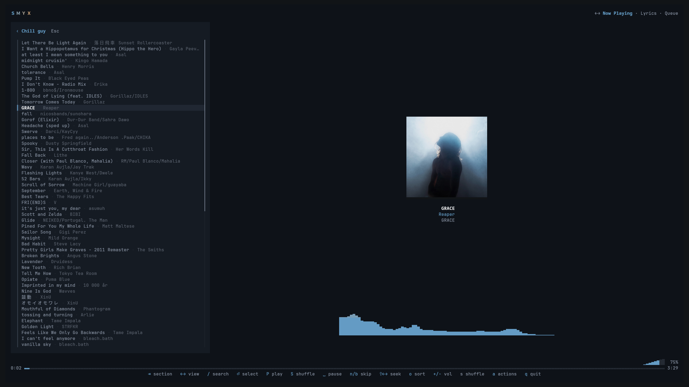
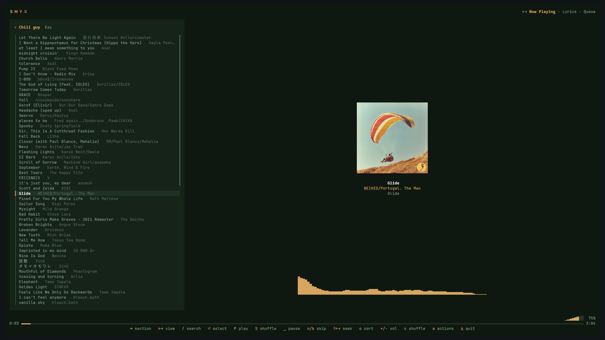
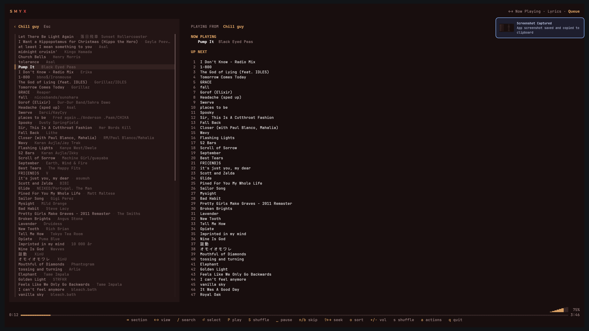
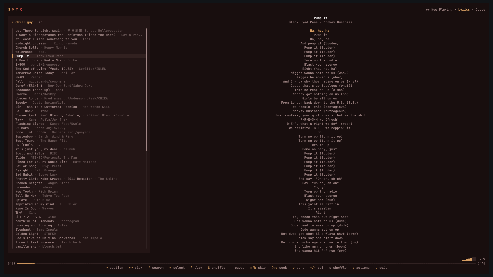

# smyx

[](https://ratatui.rs/)
[](https://crates.io/crates/smyx)


A lean, beautiful terminal Navidrome / OpenSubsonic player in Rust. Features
album-art-reactive theming, a live audio visualizer, and synced lyrics.

<p align="center"></p>

<p align="center">
  
  
  
</p>

> Requires a **Navidrome** or **OpenSubsonic** compatible server. Works on Linux, macOS, and Windows. Album art is
> crispest on Kitty, WezTerm, or foot.

## Install

Install via [Cargo](https://crates.io) (all platforms — Linux, macOS, Windows):

```bash
cargo install smyx
```

Or build from source:

```bash
git clone https://github.com/ayanchavand/Smyx.git
cd Smyx
cargo install --path .
```

## Get started

Run `smyx` in your terminal:

```bash
smyx
```

On first launch, an interactive login modal will prompt you for your Navidrome / OpenSubsonic server URL, username, and password.

Configurations are automatically saved to `~/.config/smyx/navidrome.toml` (or `%USERPROFILE%\.config\smyx\navidrome.toml` on Windows).

## Keys

```
⇥ / [ ]    switch section        ⇧⇥       switch view
↑↓ / j k   move                  ⏎        play / open
/          search                a        actions
space      play · pause          n / b    next · prev
← →        seek                  s        shuffle
+ / -      volume                R        repeat
o          sort                  r        reload
t          theme                 q        quit
```

Media keys (Play/Pause, Stop, Next, Prev, Volume) work when the terminal is
focused. Mouse works too: click tabs, click a track, double-click to play.

## Credits

`smyx` is a fork of [Myx](https://github.com/HaseebKhalid1507/Myx), which was originally a TUI for Spotify client.

Built on [ratatui](https://ratatui.rs), [rodio](https://github.com/RustAudio/rodio), and [rustfft](https://github.com/ejmahler/RustFFT). Visual language inspired by [noodle](https://github.com/wilfredinni/noodle).
See [NOTICE](NOTICE).

## License

MIT, see [LICENSE](LICENSE).

